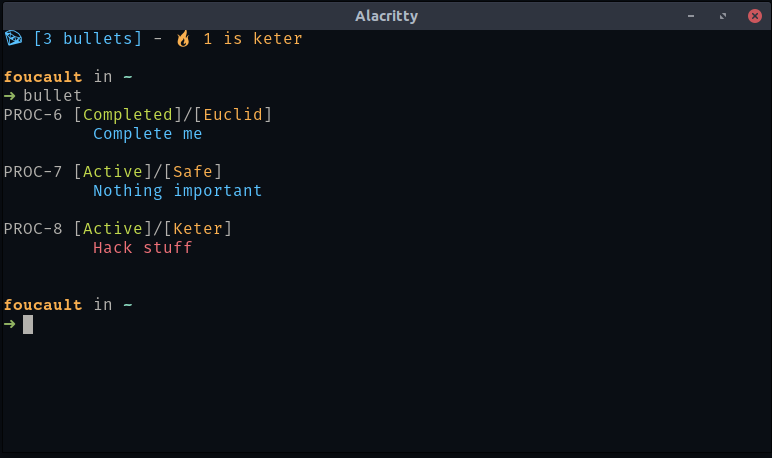

# Simple Bullet Journal

This project is a simple [bullet journal](https://en.wikipedia.org/wiki/Bullet_Journal) that works on terminal. Everytime you open the terminal, at the top journal shows the number of task active as a single line.

## Usage
<code> bullet </code>

Lists current bullets

<code> bullet add -t "msg here" -p Keter </code>

This adds a task to the current migration with `keter` priority.
This is the highest probability.

<code> bullet compelete 5 </code>

Completes the task 5

<code> bullet migrate </code>

Completes this migrations and starts a new one. 
If some bullets are safe, discarded or completed, they do not survive.

For more `bullet --help` 

## Example Visual

## Installation
First install sqlite3 to your system. Then

`cargo build --release`

`sudo cp target/release/bullet /usr/bin/bullet`

